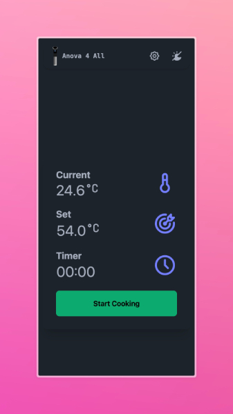

<h1>
 Anova for All
</h1>

> Recently, Anova decided to shut down their cloud services for the Anova Precision Cooker Wi-Fi 1 - although the device
> is still fully functional, and still serves its purpose.
>
> That means that while the device is still functional, the app is no longer able to connect to the device.

This project aims to provide a way to control the Anova Precision Cooker Wi-Fi without the need for the Anova app.

It uses the Anova Wi-Fi protocol to communicate with the device directly over the local network.

* **This project can be used as a library, a REST API, or a web interface.**
* This project was originally developed in Python, but then I decided to port it to Go for better performance, so it
  would run seamlessly on my Raspberry Pi.

## Features & Roadmap

- [x] Connect to the Anova Precision Cooker Wi-Fi
- [x] Discover the device on the local network (Bluetooth Low Energy)
- [x] Send commands to the device (Wi-Fi or Bluetooth)
- [x] Configure the device to work with the local server without any DNS patching
- [x] Receive responses from the device
- [x] Control the device settings
- [x] Monitor the device status
- [x] Use the library via a REST API
- [x] Use the library via a Python package
- [x] Use the library via a Go package
- [x] Implement a web interface

## Installation

1. git clone
2. install dependencies: `go mod tidy`
3. build the project: `go build ./cmd/anova4all` (to build for raspberry pi without the BLE, use
   `GOOS=linux GOARCH=arm GOARM=6 go build ./cmd/anova4all --tags no_ble`)

### Building the UI

To build the UI:

1. navigate to the `frontend` directory
2. install the dependencies using `yarn install`
3. build the UI using `yarn build --outDir ../dist`
4. To serve the UI using the FastAPI server, configure the environment variable `FRONTEND_DIST_DIR`
   to `dist/` and run the server.

## Configuration

To use the Anova for All, you need to change the `anova` package to use the server's IP address instead of the Anova
cloud services.

### Changing the server via the REST API

If your (server) device supports BLE, you can use the API to change the server address.

1. Run the server
2. Use the `POST /api/ble/config_wifi_server` endpoint.

To revert the changes, use the `POST /api/ble/restore_wifi_server` endpoint.

### Changing the server via the Web UI

You can also use the web interface to change the server address. This is usually more user-friendly :)

Notice: this require Web Bluetooth API support. Currently, it's not supported natively in iOS, but it's supported in
Android and desktop browsers. You can use an iOS app
like [Bluefy](https://apps.apple.com/us/app/bluefy-web-ble-browser/id1492822055) to connect to the device.

Notice that you must have an encrypted connection(tls - https) to the server to use the Web Bluetooth API. You can use
the server-less version of the UI over https://almogbaku.com/Anova4All/ .

## Usage

OpenAPI documentation is available at `http://localhost:8000/docs`.

When configuring the `FRONTEND_DIST_DIR` environment variable, the UI will be available at `http://localhost:8000/`.

### Using the deployed UI

You can use the deployed UI, and set your own server address in the Settings page: https://AlmogBaku.com/Anova4All/
This saves the configuration in the browser's local storage.

This can be quite useful if you deploy the server on a Raspberry Pi or similar device, expose it externally, and use the
UI from anywhere.

## References

Thanks for @TheUbuntuGuy for the initial research on the Anova Wi-Fi protocol:

- https://www.youtube.com/watch?v=xDDPFHhY7ec
- https://gist.github.com/TheUbuntuGuy/225492a8dec816d49b70d9c21811e8b1

**Important**: This project is not affiliated with Anova or any other company. It's a community project that aims to
keep the device functional after the cloud services are shut down.
